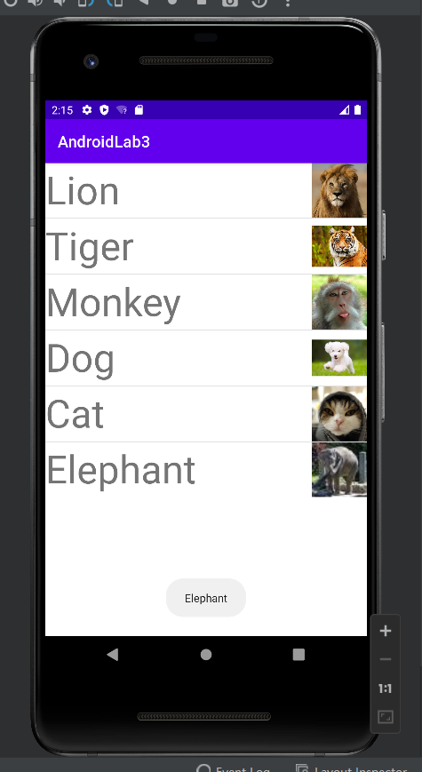
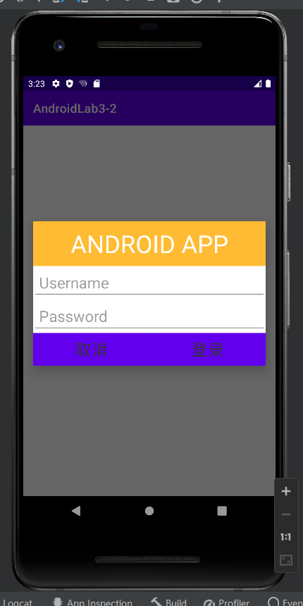
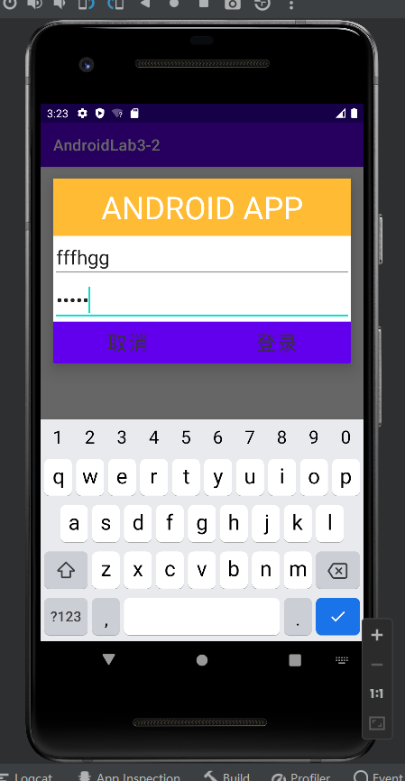
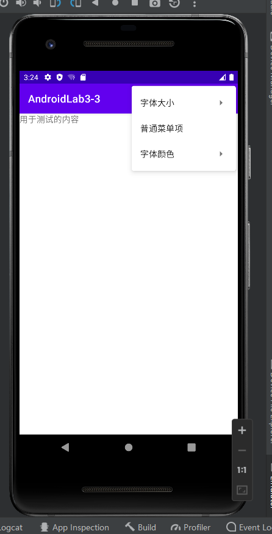
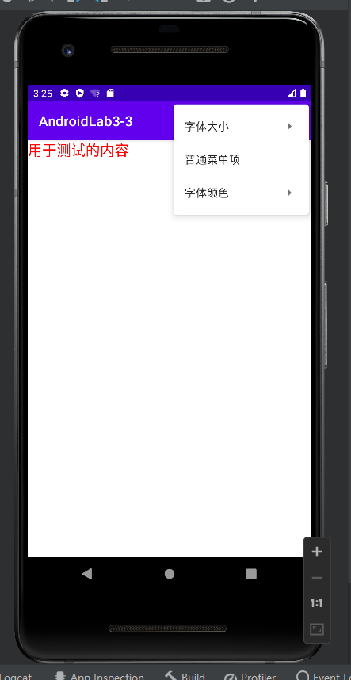
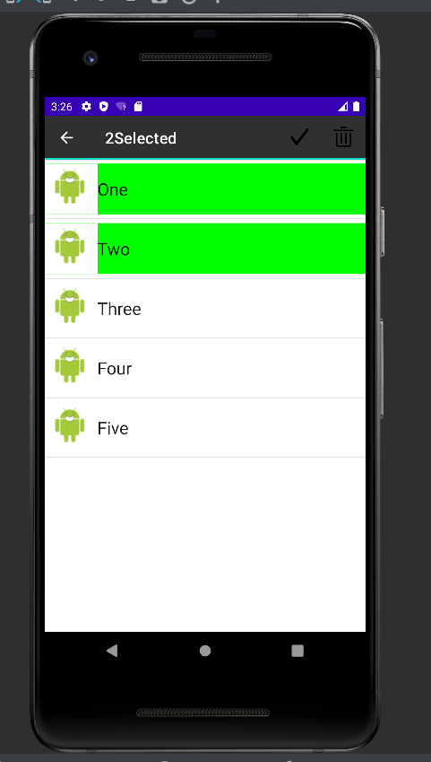
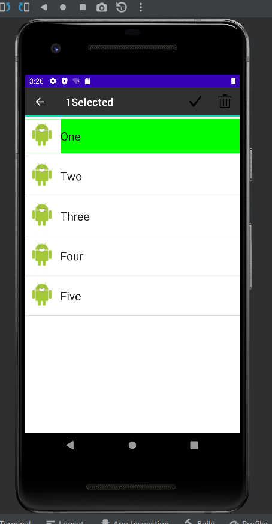

# AndroidLab3 界面组件实验
### Test1 Android ListView的用法
##### 思路
①layout文件中编写单元组件  
②通过id，在MainActivity中id:image与图片组件,id：name与文字组件绑定  
③利用SimpleAdapter绑定组件进行for循环遍历输出  
④Toast显示，响应选中事件的列表项取其对应的name属性值  

##### 部分代码展示
①layout单元组件  
```
<TextView
        android:id="@+id/names"
        android:layout_width="match_parent"
        android:layout_height="match_parent"
        android:textSize="50dp"
        />

    <ImageView
        android:id="@+id/images"
        android:layout_width="70dp"
        android:layout_height="70dp"
        app:layout_constraintLeft_toRightOf="@id/names"
        app:layout_constraintRight_toRightOf="parent"
        app:layout_constraintTop_toTopOf="parent"
        app:layout_constraintHorizontal_bias="1.0"
        />
```
②组件绑定
```
SimpleAdapter simpleAdapter = new SimpleAdapter(MainActivity.this,
                lists, R.layout.simple_adapter,
                new String[] {"names","images"},
                new int[] {R.id.names,R.id.images});
        listView.setAdapter(simpleAdapter);
```

③ListView循环输出
```
List<Map<String,Object>> lists = new ArrayList<>();
        for (int i = 0;i < names.length;i++){
            Map<String,Object> list = new HashMap<>();
            list.put("images",imgIds[i]);
            list.put("names",names[i]);
            lists.add(list);
        }

        ListView listView = findViewById(R.id.list_view01);
```

④单击显示图片名字
```
listView.setOnItemClickListener(new AdapterView.OnItemClickListener(){

            @Override
            public void onItemClick(AdapterView<?> parent, View view, int position, long id) {
                Toast toast = Toast.makeText(MainActivity.this,names[position],Toast.LENGTH_SHORT);
                toast.show();
            }
```
##### 实验结果


### Test2 创建自定义布局的AlertDialog
##### 思路
①在layout界面编辑好布局界面  
②调用AlertDialogalert设置Dialog.show()将布局添加到AlertDialog   

##### 部分代码展示
①layout界面编辑，android：hint设置提示信息，android:inputtype=“password”设置输入类型为密码即可隐藏密码
```
<EditText
        android:id="@+id/userName"
        android:layout_width="match_parent"
        android:layout_height="wrap_content"
        android:hint=" Username"
        app:layout_constraintTop_toBottomOf="@id/title"
        android:textSize="25dp"/>

    <EditText
        android:id="@+id/password"
        android:layout_width="match_parent"
        android:layout_height="wrap_content"
        android:hint=" Password"
        android:textSize="25dp"
        android:inputType="textPassword"
        app:layout_constraintTop_toBottomOf="@id/userName" />
```
②通过AlertDialog设置alertDialog.show()将布局添加到AlertDialog
```
protected void onCreate(Bundle savedInstanceState) {
        super.onCreate(savedInstanceState);
        AlertDialog alertDialog = new AlertDialog(MainActivity.this);
        alertDialog.show();
    }
```
```
WindowManager windowManager = getWindow().getWindowManager();
        Display display = windowManager.getDefaultDisplay();
        WindowManager.LayoutParams p = getWindow().getAttributes();
        Point size = new Point();
        display.getSize(size);
        p.width = size.x;
        getWindow().setAttributes(p);
```
##### 实验结果
  
  


### Test3 使用XML定义菜单
##### 思路
①新建menu.xml编写菜单样式  
②layout加入一个用于测试的TextView  
③在MenuActivity中装填对应的菜单并添加到menu中  
④通过switch-case根据menu各项绑定的id进行切换操作即大、中、小改变字体大小;红、黑改变字体颜色  
##### 部分代码展示
①菜单样式
```
<item
        android:id="@+id/menu_size"
        android:title="字体大小">
        <menu xmlns:android="http://schemas.android.com/apk/res/android">
            <item
                android:id="@+id/menu_size_1"
                android:title="小" />
            <item
                android:id="@+id/menu_size_2"
                android:title="中" />
            <item
                android:id="@+id/menu_size_3"
                android:title="大" />
        </menu>
    </item>
```
②MainActivity装填
```
public boolean onCreateOptionsMenu(Menu menu) {
        MenuInflater menuinflater = getMenuInflater();
        menuinflater.inflate(R.menu.menu, menu);
        return true;
    }
```
③switch-case设置选择并改变测试文本样式
```
switch (item.getItemId()) {
            case R.id.menu_size_1:
                test.setTextSize(11);
                return true;
            case R.id.menu_size_2:
                test.setTextSize(16);
                return true;
            case R.id.menu_size_3:
                test.setTextSize(21);
                return true;
            case R.id.menu_common:
                Toast.makeText(MainActivity.this,"这是普通菜单项",Toast.LENGTH_SHORT).show();
                return true;
            case R.id.menu_color_red:
                test.setTextColor(Color.RED);
                return true;
            case R.id.menu_color_yellow:
                test.setTextColor(Color.YELLOW);
                return true;
            default:
                return super.onOptionsItemSelected(item);
        }
```
##### 实验结果
  
  


### Test4 创建上下文操作模式(ActionMode)的上下文菜单
##### 思路
①layout放置一个ListView，将choiceMode设置为multipleChoiceModal，也就是可以为多选  
②第二个layout文件用相对布局描述每个ListView的选项，同时每个选项都包括一个ImageView和TextView，分别用来显示图片和文本  
③item类，即每个选项对应的类。其中bo属性就是用来记录该选项是否被选中，选中值就为true，当初始化是都会传入false，也就是默认不选择  
④自定义的适配器，为这个ListView自定义一个相应的适配器  
⑤MainActivity，先是加载布局文件，定义相应的变量，接着把各个数据填充，然后新建适配器，再为ListView设置适配器。接着设置监听，同时对actionMode菜单的每个按钮设置各自对应的点击事件

##### 部分代码展示
①layout布局
```
<ListView
            android:id="@+id/list_view"
            android:layout_width="match_parent"
            android:layout_height="match_parent"
            android:choiceMode="multipleChoiceModal"
            />
```
```
<TextView
        android:id="@+id/text_view"
        android:layout_width="344dp"
        android:layout_height="65dp"
        android:layout_alignParentEnd="true"
        android:layout_alignParentRight="true"
        android:gravity="center_vertical"
        android:textAppearance="?android:textAppearanceLarge"
        app:layout_constraintEnd_toEndOf="parent"
        tools:layout_editor_absoluteY="-1dp" />

    <ImageView
        android:id="@+id/img"
        android:layout_width="65dp"
        android:layout_height="65dp"
        android:src="@drawable/a1"/>
```
②Item类
```
public Item(String name,boolean bo){
        super();
        this.name = name;
        this.bo = bo;
    }
```
③适配器,内部类ViewHolder是为每一个listview的选项有多个组件自定义的，这里每个选项都有一个ImageView和TextView，然后可以在ViewHolder中定制，然后在getView()方法中加载相应布局文件以及各个组件，然后对应填充 ,x选中时改变颜色 
```
public Adapter(List<Item> list,Context context){
        this.context = context;
        this.list = list;
        notifyDataSetChanged();
    }
```
```
final ViewHolder viewHolder;
        if(convertView==null){
            convertView=View.inflate(context,R.layout.checkbox_item,null);
            viewHolder=new ViewHolder();
            viewHolder.imageView=(ImageView) convertView.findViewById(R.id.img);
            viewHolder.textView=(TextView) convertView.findViewById(R.id.text_view);
            convertView.setTag(viewHolder);
        }
        else{
            viewHolder=(ViewHolder) convertView.getTag();
        }
```
```
viewHolder.textView.setText(list.get(position).getName());
        if(list.get(position).isBo() == true){
            viewHolder.textView.setBackgroundColor(green);
            viewHolder.imageView.setBackgroundColor(green);
        }
        else{
            viewHolder.textView.setBackgroundColor(white);
            viewHolder.imageView.setBackgroundColor(white);
        }
```
④MainActivity抬头显示几个被选中
```
public void onItemCheckedStateChanged(ActionMode mode, int position, long id, boolean checked) {
                if (checked == true) {
                    list.get(position).setBo(true);
                    adapter.notifyDataSetChanged();
                    num++;
                } else {
                    list.get(position).setBo(false);
                    adapter.notifyDataSetChanged();
                    num--;
                }
                mode.setTitle(" " + num + "Selected");
            }
```
##### 实验结果
  
  